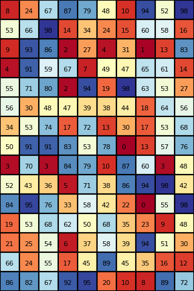
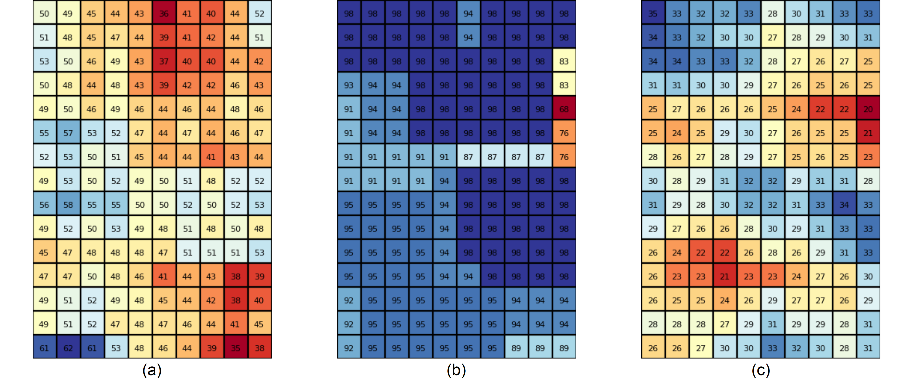
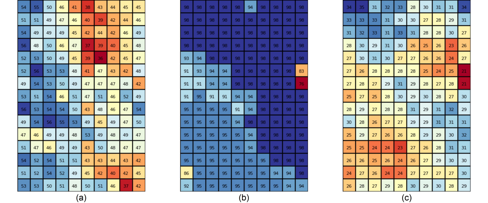
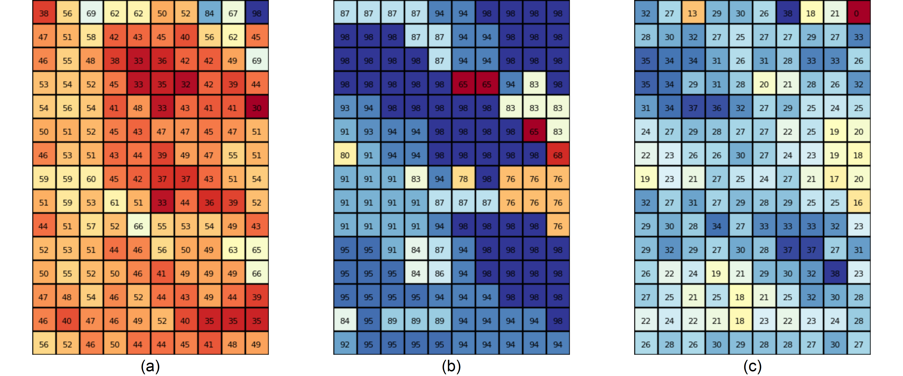

```{r setup, include=FALSE}
knitr::opts_chunk$set(echo = FALSE)
# setwd(dir = "C:/Users/Brigggi/Desktop/gis_plus/")
```

# Goal

<!-- - Create an image-filtering tool that follows the same concept as the  -->
<!-- Focal  Statistics  from  ArcGIS. -> Maybe an example for application for focal statistics? -->
<!-- - Moving window of different shapes. -->
<!-- - Different summary statistics. -->

The goal of the project is to create an image-filtering tool that follows the same concept as the 
Focal  Statistics  from  ArcGIS. This tool iterates through every cell of the input raster and calculates a statistic of the values that surround it. These surrounding values are determined by different so called neihborhoods. The neighborhoods we will implement are *Square*, *Rectangle*, *Circle* and *Wedge* (see figure \ref{fig:neighb}), available statistics will be *minimum*, *maximum*, *mean*, *standard deviation* and *variance*.

<!-- I only describe three neighborhoods, since square and rectangle are basically the same. Don't know if we need to distinguish between them.

Ich habs jetzt gemacht, weil er das in der Aufgabenstellung ja auch so hatte. Hab dazu jetzt aber eigentlich auch keine starke Meinung, also wenns dich stört, machs weg. -->


# Methods and challenges

<!-- - Programmed in Python. -->
<!-- - Tried to stay close to the arc gis implementation -->
<!-- - Describe how the different windows get determined -->
<!-- - Describe what ignore_nodata does, especially concerning the edges of the array (pictures?) -->
<!-- - Two approaches for different neighborhoods (didn't want to discard the work, plus both work) -->
<!-- - Approach Rectangle (difficulties, packages, bla bla bla) -->
<!-- - Approach Circle, Wedge (difficulties, packages, bla bla bla) -->


The project is programmed in Python. We tried to stay close to the ArcGIS implementation of focal statistics. The exact implementation can be found here: [ArcGis' Focal Statistics](https://desktop.arcgis.com/en/arcmap/10.3/tools/spatial-analyst-toolbox/how-focal-statistics-works.htm). The main challenges were the implementation of the different neighborhoods and the question how to deal with the problem that arises when the processed cell is close to the edge of the raster and the neighborhood window would reach outside of the boundary.

## The Neighborhood types

**Square:** The square has the same height as width. When they are odd, a central pixel in the middle of the square can be determined. When they are even, the middle is between two pixels. Here, the center is assigned to the left respectively the top one of the possible central pixels.

**Rectangle:** The rectangular window has different heights and widths, but is similar to the square otherwise. See figure \ref{fig:windows}a for an example with even height and width.


**Circle:** The neighborhood window is defined by a circle around the processed cell. The radius is determined by user input. Any cell whose center falls inside the specified radius is included in the window (see \ref{fig:windows}b).


**Wedge:** Similar to the *Circle* neighborhood, the user defines a radius that determines the cells included in the window. But instead of a full 360° circle, the user chooses a start and end angle determining the part of the circle that makes up the neighborhood window. The wedge spans counterclockwise from the start to the end angle, which must be given in degrees from 0° to 360°, the positive x-axis being 0° (see \ref{fig:windows}c).


## The edge problem

Due to division of labour, we have two different approaches for dealing with the edge problem. The first one is applied in the *Square* and *Rectangle* neighborbood and categorises cells in normal and edge cases. For the *Cirlce* and *Wedge*, we use padding. 

For the square and the rectangle neighborhood, we use two functions: *rectangfun* and *get_newdata*. The first determines the number of pixels from the central pixel to all four sides. This depends on whether the height and width of the window is even or odd. Is the width even, the central pixel is assigned to the left pixel of the two possible middle pixels. For an even height, the central pixel is the top pixel.

Now, "get_newdata" uses the information about the window size in order to calculate the output data. For the argument *ignore_nodata* equals true, it categorises the data into normal case and edge and corner cases, where the neighorhood shape would be bigger than the data frame. Here, it shrinks the neighborhood to the available pixels in the neighbourhood. A code example using the upper left corner:


```{r echo=TRUE, eval=FALSE}
for col in range(np.size(data, 1)):
            for row in range(np.size(data, 0)):
                
                # all corners:
                if col < wsize_left and row < wsize_top: # topleft
                    window = data[:row+wsize_bot+1, :col+wsize_right+1]
```

Here, the code iterates through all pixels in the matrix, searching for those, whose neighborhood is reaching out of the edges of the matrix. In *col < wsize_left*, it is checked if the column of the pixel is smaller than the left window size of the neighorhood. If this is the case, as well as the row number of the pixel is smaller than the top window size, the code calculates the window for the upper left case.  
The data gets sliced. From the very top of the matrix until the bottom edge of the neighborhood the rows get addressed. For the columns, the slice goes from the very left of the matrix until the right edge of the neighborhood.  

In all cases, the statistical function is applied to the neighborhood window and the result is stored in a new data frame. If there is an NA value in the data frame, the calculation is made with the remaining.  
Is *ignore_nodata* equals false, all pixels whose neighborhoods extend beyond the edges, are set to NA values. Besides, all pixels with NA values in their neighborhood get also NA values.
The code for the rectangle approach uses base Python and numpy.

In the case of the *Circle* and *Wedge* neighborhood, before iterating through the raster cells, the raster gets padded with a number of rows and columns. The number depends on the radius the user determines and ensures that the window around the cell close to the edge of the input raster never extends past the boundary of the padded raster. The cells of the padding are filled with *NA* values and hence the *ignore_nodata* argument defines how the edge cells will be filled. When *ignore_nodata* is set to *true* (the default), the statistic will be applied to all the values of the window that are not *NA*, when it is set to *false* the cell will be replaced by *NA*, effectively reducing the size of the output raster.

# Result

The following figures show the resulting output rasters for three different types of neighborhoods (figure \ref{fig:rec} = rectangle, figure \ref{fig:circle} = circle and figure \ref{fig:wedge} = wedge) and statistics ((a) = *mean*, (b) = *max* and (c) = *standard deviation*). The input raster has always been the same and can be seen in figure \ref{fig:input}.

{width=27%}









